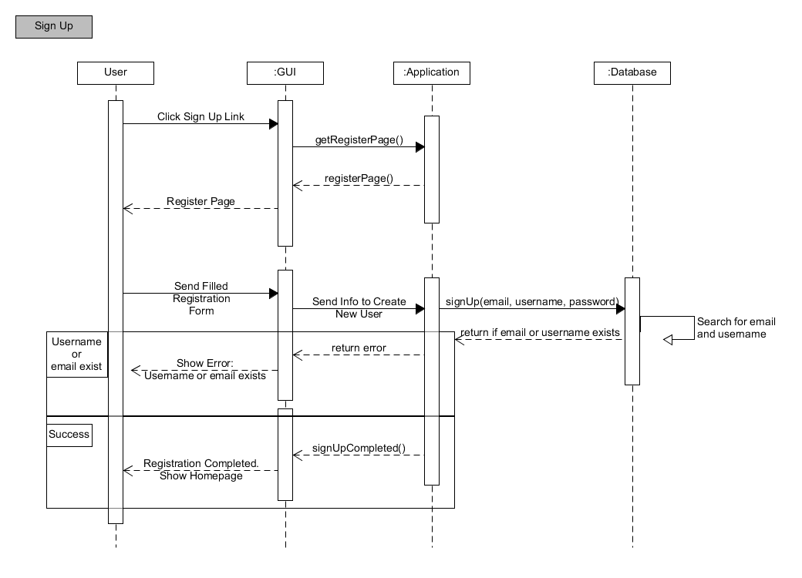
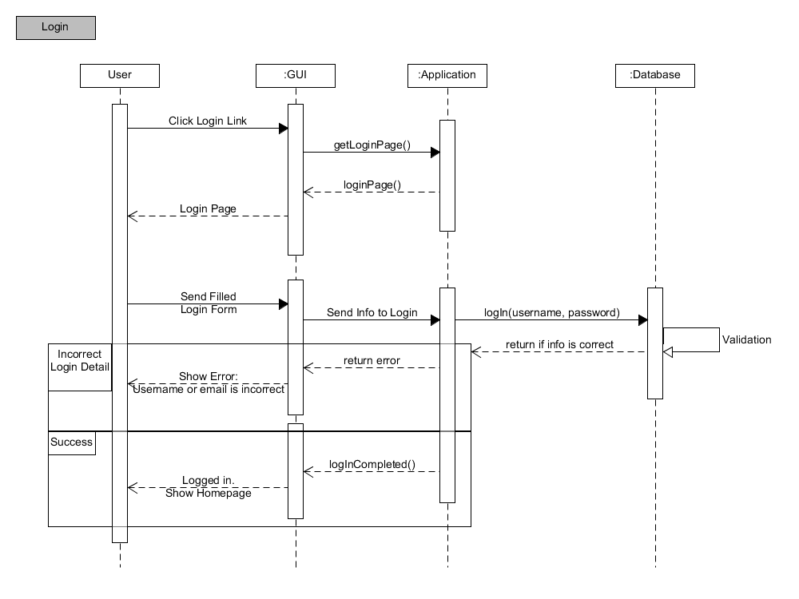
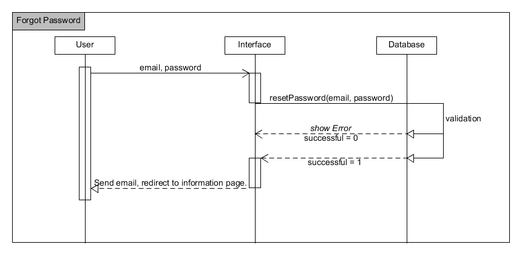

Air B'n'B on an INTERGALACTIC scale. Our users take advantage of our state of the art web app to book short term accomodation in locations around the universe. From Saturn to Pluto, from the centre of the Andromeda nebula to the ends of the Milky Way, Spaced Out is where its at for your non-terrestrial travel needs!

## Spec

- Any signed-up user can list a new space.
- Users can list multiple spaces.
- Users should be able to name their space, provide a short description of the space, and a price per night.
- Users should be able to offer a range of dates where their space is available.
- Any signed-up user can request to hire any space for one night, and this should be approved by the user - that owns that space.
- Nights for which a space has already been booked should not be available for users to book that space.
Until a user has confirmed a booking request, that space can still be booked for that night.

## User Stories

### User Account
```
As a user
So that I list a space
I want to sign up to the website

As a user 
So that can confirm my sign up
I want to be able to receive an email confirmation

As a user
So that I can book or host a space
I want to be able to sign in

As a user
So that I can protect my acount
I want to be able to sign out
```

### Listing Spaces
```
As a host
So that I can list a space
I want to be able to add a space on the spaces /new page

As a host
So that I can tell guests when a space is available
I want to be able to put the availability in my calendar

As a host
So that i can specify when the space is available
I want to specify on the listing an available from/available from date

As a host
So that I can tell guests how much a night is
I want to be able to list the price per night on my listing

As a host 
So that a guest can make an informed decision
I want to be able to add a description of my listing

As a host
So that I can approve bookings
I want to see a list of booking requests for spaces that I own

As a host
So that I can confirm bookings
I want to be able to accept or reject bookings

As a host
So that I can efficiently reject bookings
I want them to be auto rejected when I accept a single request
```

### Booking Spaces
```
As a guest
So that I can see the range available
I want to be able to see a full page of listings

As a guest
So that I can see relevant listings
I want to be able to filter by date

As a guest
So that I can book one night
I want to be able to select a date and request a booking

As a guest
So that i know that my booking has been accepted
I want to receive an email confirming the booking

As a guest
So that i know that my booking has been rejected
I want to receive an email notification

As a guest 
So that I don’t book a date that has already been booked
I want to only be able to select available dates

As a guest
So that I can give the host options
I want to be able to request a date that have already been requested
```

## Database tables

`users` table:
| Field | Type |
| --- | --- |
| id | SERIAL PRIMARY ID |
| name | VARCHAR(100) |
| email | VARCHAR(200) |
| password | VARCHAR(50) |
| username | VARCHAR(50) |

`bookings` table:
| Field | Type |
| --- | --- |
| id | SERIAL PRIMARY ID |
| date | DATETIME |
| space_id | FOREIGN ID |
| user_id | FOREIGN ID |
| status | VARCHAR(20) |

`spaces` table:
| Field | Type |
| --- | --- |
| id | SERIAL PRIMARY ID |
| name | VARCHAR(300) |
| description | VARCHAR(2000) |
| location | VARCHAR(100) |
| available_to | DATETIME |
| available_from | DATETIME |
| images | URL |


## Objects

| Object | Message |
| --- | --- |
| User | @username |
| |  @realname |
| | @email |
| | @id |

| Object | Message |
| --- | --- |
| Booking | @space |
| | @date |
| | .instance |
| | .create |

| Object | Message |
| --- | --- |
| Space | @name |
| | .all |

## Control Flow: User

Diagram showing action sequence for a user signing up:



Diagram showing action sequence for a user logging in:



Diagram showing action sequence for a forgotten password:




